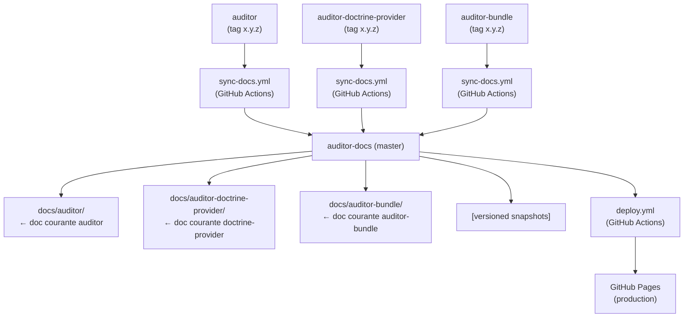

# Release Guide

Ce document décrit le processus de publication d'une nouvelle version des packages **auditor**,
**auditor-doctrine-provider** et **auditor-bundle**, et comment la documentation est mise à jour
automatiquement.

---

## Vue d'ensemble du pipeline



**Tout est automatisé** à partir du moment où un tag est poussé sur l'un des trois repos.

---

## Prérequis

### Secret GitHub requis

Les workflows `sync-docs.yml` des trois repos ont besoin d'un **Personal Access Token (PAT)**
pour pouvoir écrire dans ce repo (`auditor-docs`).

1. Créer un PAT sur GitHub : **Settings → Developer settings → Personal access tokens → Fine-grained tokens**
   - Repository : `DamienHarper/auditor-docs`
   - Permissions : `Contents: Read and Write`
2. Ajouter ce token comme secret dans **chacun** des trois repos :
   - **Settings → Secrets and variables → Actions → New repository secret**
   - Nom : `AUDITOR_DOCS_PAT`
   - Valeur : le token créé ci-dessus

> ⚠️ Sans ce secret, les workflows `sync-docs.yml` échouent silencieusement.

---

## Cas 1 — Release mineure ou patch (ex : 5.1.0, 2.1.0, 8.1.0)

**Aucune action manuelle sur auditor-docs.**

1. Mettre à jour la doc dans `docs/` du repo concerné
2. Pousser le tag :
   ```bash
   git tag 5.1.0
   git push origin 5.1.0
   ```
3. Le workflow `sync-docs.yml` se déclenche automatiquement :
   - Copie `docs/` → `auditor-docs/docs/<plugin>/`
   - Commit + push sur `auditor-docs/master`
4. Le workflow `deploy.yml` d'`auditor-docs` se déclenche automatiquement :
   - Build Docusaurus
   - Déploiement sur GitHub Pages

**Total : ~3 min, zéro intervention.**

---

## Cas 2 — Release majeure (ex : 6.0.0, 3.0.0, 9.0.0)

**Aucune action manuelle non plus**, le versioning est géré automatiquement.

Quand le tag poussé est de la forme `X.0.0` (nouveau major) :

1. Le workflow `sync-docs.yml` détecte le changement de version majeure
2. Il **gèle automatiquement** la version courante via, ex. pour auditor :
   ```bash
   npm run docusaurus -- docs:version:auditor "5.x"
   ```
   Cela crée `auditor_versioned_docs/version-5.x/` — snapshot immuable
3. Il remplace ensuite `docs/auditor/` par la nouvelle doc 6.x
4. Un seul commit est pushé sur `auditor-docs` avec tout ça
5. `deploy.yml` reconstruit et déploie

**Le sélecteur de version dans le site est automatiquement mis à jour.**

---

## Processus de release étape par étape

### Pour `auditor`

```bash
# 1. S'assurer que docs/ est à jour dans le repo auditor
cd /path/to/auditor

# 2. Créer et pousser le tag
git tag 5.0.0           # ou 5.1.0 pour un patch/minor
git push origin 5.0.0

# C'est tout. Surveiller le workflow sur :
# https://github.com/DamienHarper/auditor/actions
```

### Pour `auditor-doctrine-provider`

```bash
cd /path/to/auditor-doctrine-provider

git tag 2.0.0
git push origin 2.0.0

# Surveiller :
# https://github.com/DamienHarper/auditor-doctrine-provider/actions
```

### Pour `auditor-bundle`

```bash
cd /path/to/auditor-bundle

git tag 8.0.0
git push origin 8.0.0

# Surveiller :
# https://github.com/DamienHarper/auditor-bundle/actions
```

### Vérifier le déploiement

```
https://github.com/DamienHarper/auditor-docs/actions
→ workflow "Deploy to GitHub Pages"
→ https://damienharper.github.io/auditor-docs/
```

---

## Cas exceptionnels (intervention manuelle)

### Corriger la doc sans faire de release

Si tu dois corriger une faute ou améliorer la doc sans pousser de nouvelle version :

```bash
cd /path/to/auditor-docs

# Modifier directement docs/auditor/, docs/auditor-doctrine-provider/
# ou docs/auditor-bundle/ (ou les versioned_docs pour une ancienne version)

git add -A
git commit -m "docs: fix typo in querying page"
git push
# → deploy.yml se déclenche automatiquement
```

### Modifier le thème / la configuration Docusaurus

```bash
cd /path/to/auditor-docs

# Modifier src/css/custom.css, src/pages/index.js, docusaurus.config.mjs…

git add -A
git commit -m "style: update hero dark mode"
git push
# → deploy.yml se déclenche automatiquement
```

### Corriger une ancienne version de la doc

Les snapshots gelés sont dans `auditor_versioned_docs/`,
`auditor-doctrine-provider_versioned_docs/` et `auditor-bundle_versioned_docs/`.

```bash
# Exemple : corriger la doc auditor 4.x
vim auditor_versioned_docs/version-4.x/installation.md

git add -A
git commit -m "docs(4.x): fix installation instructions"
git push
```

---

## Architecture des dossiers

```
auditor-docs/
├── docs/
│   ├── auditor/                          ← doc COURANTE auditor (en développement)
│   ├── auditor-doctrine-provider/        ← doc COURANTE doctrine-provider (en développement)
│   └── auditor-bundle/                   ← doc COURANTE auditor-bundle (en développement)
│
├── auditor_versioned_docs/
│   └── version-4.x/                      ← snapshot GELÉ de auditor 4.x
│
├── auditor-doctrine-provider_versioned_docs/
│   └── version-1.x/                      ← snapshot GELÉ de auditor-doctrine-provider 1.x
│
├── auditor-bundle_versioned_docs/
│   └── version-7.x/                      ← snapshot GELÉ de auditor-bundle 7.x
│
├── auditor_versions.json                  ← liste des versions gelées de auditor
├── auditor-doctrine-provider_versions.json ← liste des versions gelées de doctrine-provider
├── auditor-bundle_versions.json           ← liste des versions gelées de auditor-bundle
│
├── src/
│   ├── css/custom.css                     ← thème global
│   └── pages/index.js                     ← page d'accueil
│
├── docusaurus.config.mjs                  ← configuration Docusaurus
└── .github/workflows/
    └── deploy.yml                         ← build + déploiement GitHub Pages (on: push master)
```

---

## Checklist de release

### Release mineure / patch

- [ ] Doc à jour dans `docs/` du repo concerné
- [ ] Tag poussé (`git tag X.Y.Z && git push origin X.Y.Z`)
- [ ] Workflow `sync-docs` ✅ (GitHub Actions)
- [ ] Workflow `deploy` ✅ (GitHub Actions)

### Release majeure (X.0.0)

- [ ] Doc de la **nouvelle** version dans `docs/` du repo concerné
- [ ] Tag `X.0.0` poussé
- [ ] Vérifier que le snapshot de l'ancienne version est bien créé dans `*_versioned_docs/`
- [ ] Vérifier que `*_versions.json` est mis à jour
- [ ] Vérifier le sélecteur de version sur le site déployé
