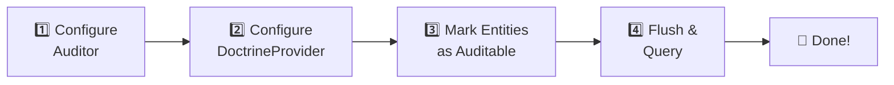

# Quick Start Guide

> **Set up auditing for your Doctrine entities in minutes**

This guide will help you set up auditing for your Doctrine ORM entities in minutes.

## 🔍 Overview

Setting up auditor-doctrine-provider involves four main steps:



1. **Configure the Auditor** — Set up global options (timezone, user provider, etc.)
2. **Configure the DoctrineProvider** — Define which entities to audit and how
3. **Mark entities as auditable** — Use the `#[Auditable]` attribute
4. **Flush and query** — Changes are tracked automatically; read them back via the `Reader`

## 1️⃣ Step 1: Configure the Auditor

```php
<?php

use DH\Auditor\Auditor;
use DH\Auditor\Configuration;
use DH\Auditor\User\User;
use Symfony\Component\EventDispatcher\EventDispatcher;

// Create the Symfony event dispatcher (for LifecycleEvents)
$eventDispatcher = new EventDispatcher();

// Create the auditor configuration
$configuration = new Configuration([
    'enabled'           => true,
    'timezone'          => 'UTC',
    'user_provider'     => null,  // Optional: callable to get current user
    'security_provider' => null,  // Optional: callable for security context
    'role_checker'      => null,  // Optional: callable to check viewing permissions
]);

// Create the Auditor instance
$auditor = new Auditor($configuration, $eventDispatcher);
```

## 2️⃣ Step 2: Configure the DoctrineProvider

```php
<?php

use DH\Auditor\Provider\Doctrine\Configuration as DoctrineConfiguration;
use DH\Auditor\Provider\Doctrine\DoctrineProvider;
use DH\Auditor\Provider\Doctrine\Service\AuditingService;
use DH\Auditor\Provider\Doctrine\Service\StorageService;

// Create provider configuration
$providerConfiguration = new DoctrineConfiguration([
    'table_prefix'    => '',
    'table_suffix'    => '_audit',
    'ignored_columns' => [],       // Columns to ignore globally
    'entities'        => [
        // Entities configuration (alternative to / merged with attributes)
        App\Entity\Post::class => [
            'enabled' => true,
        ],
    ],
]);

// Create the DoctrineProvider
$provider = new DoctrineProvider($providerConfiguration);

// Register auditing and storage services using the same EntityManager
// (use separate EntityManagers for multi-database setups)
$provider->registerAuditingService(new AuditingService('default', $entityManager));
$provider->registerStorageService(new StorageService('default', $entityManager));

// Register the provider with the Auditor
$auditor->registerProvider($provider);
```

> [!NOTE]
> `registerAuditingService()` automatically registers the `DoctrineSubscriber` on the Doctrine event system. No additional wiring is needed.

## 3️⃣ Step 3: Mark Entities as Auditable

```php
<?php

namespace App\Entity;

use DH\Auditor\Attribute\Auditable;
use DH\Auditor\Attribute\Ignore;
use DH\Auditor\Attribute\Security;
use Doctrine\ORM\Mapping as ORM;

#[ORM\Entity]
#[ORM\Table(name: 'posts')]
#[Auditable]
#[Security(view: ['ROLE_ADMIN'])]  // Optional: restrict who can view audits
class Post
{
    #[ORM\Id]
    #[ORM\GeneratedValue]
    #[ORM\Column(type: 'integer')]
    private ?int $id = null;

    #[ORM\Column(type: 'string')]
    private string $title = '';

    #[ORM\Column(type: 'text')]
    private string $content = '';

    #[Ignore]  // This field won't be audited
    private string $internalCache = '';

    // getters/setters...
}
```

## 4️⃣ Step 4: Start Auditing

Once configured, the library automatically tracks changes when you flush your EntityManager:

```php
<?php

// Create a new post
$post = new App\Entity\Post();
$post->setTitle('Hello World');
$post->setContent('My first post.');

$entityManager->persist($post);
$entityManager->flush();  // ← INSERT audit entry is created here

// Update the post
$post->setTitle('Hello auditor!');
$entityManager->flush();  // ← UPDATE audit entry is created (with diff)

// Delete the post
$entityManager->remove($post);
$entityManager->flush();  // ← REMOVE audit entry is created
```

## 📖 Reading Audit Logs

Use the `Reader` class to query audit entries:

```php
<?php

use DH\Auditor\Provider\Doctrine\Persistence\Reader\Reader;

$reader = new Reader($provider);

// Get all audits for the Post entity
$query = $reader->createQuery(App\Entity\Post::class);
$audits = $query->execute();

// Get audits for a specific post ID
$query = $reader->createQuery(App\Entity\Post::class, [
    'object_id' => 42,
]);
$audits = $query->execute();

// Get audits with pagination
$query = $reader->createQuery(App\Entity\Post::class, [
    'page'      => 1,
    'page_size' => 20,
]);
$result = $reader->paginate($query);

// Inspect entries
foreach ($audits as $entry) {
    echo $entry->type . ': ' . $entry->objectId . "\n";
}
```

## 🔗 Complete Bootstrap Example

```php
<?php

use DH\Auditor\Auditor;
use DH\Auditor\Configuration;
use DH\Auditor\User\User;
use DH\Auditor\Provider\Doctrine\Configuration as DoctrineConfiguration;
use DH\Auditor\Provider\Doctrine\DoctrineProvider;
use DH\Auditor\Provider\Doctrine\Persistence\Reader\Reader;
use DH\Auditor\Provider\Doctrine\Persistence\Schema\SchemaManager;
use DH\Auditor\Provider\Doctrine\Service\AuditingService;
use DH\Auditor\Provider\Doctrine\Service\StorageService;
use Symfony\Component\EventDispatcher\EventDispatcher;

// --- 1. Configure Auditor ---
$auditorConfig = new Configuration([
    'enabled'  => true,
    'timezone' => 'UTC',
]);
$auditorConfig->setUserProvider(fn (): ?User => new User('1', 'alice'));
$auditorConfig->setSecurityProvider(fn (): array => ['127.0.0.1', 'main']);

$auditor = new Auditor($auditorConfig, new EventDispatcher());

// --- 2. Configure DoctrineProvider ---
$provider = new DoctrineProvider(new DoctrineConfiguration([
    'table_suffix' => '_audit',
    'entities'     => [
        App\Entity\Post::class => ['enabled' => true],
    ],
]));

// $entityManager is your Doctrine EntityManagerInterface instance
$provider->registerAuditingService(new AuditingService('default', $entityManager));
$provider->registerStorageService(new StorageService('default', $entityManager));
$auditor->registerProvider($provider);

// --- 3. Update audit schema (creates audit tables) ---
(new SchemaManager($provider))->updateAuditSchema();

// --- 4. Done! All Post changes are now audited ---
$post = new App\Entity\Post();
$post->setTitle('Hello World');
$entityManager->persist($post);
$entityManager->flush();

// --- 5. Read audit log ---
$reader = new Reader($provider);
$entries = $reader->createQuery(App\Entity\Post::class)->execute();
foreach ($entries as $entry) {
    printf("[%s] #%s\n", $entry->type, $entry->objectId);
}
```

---

## What's Next?

- ⚙️ [Configuration Reference](../providers/doctrine/configuration.md) — Detailed configuration options
- 🏷️ [Attributes Reference](../providers/doctrine/attributes.md) — Complete attributes documentation
- 🔍 [Querying Audits](../querying/index.md) — Advanced query techniques
- 🗄️ [Multi-Database Setup](../providers/doctrine/multi-database.md) — Separate audit storage
