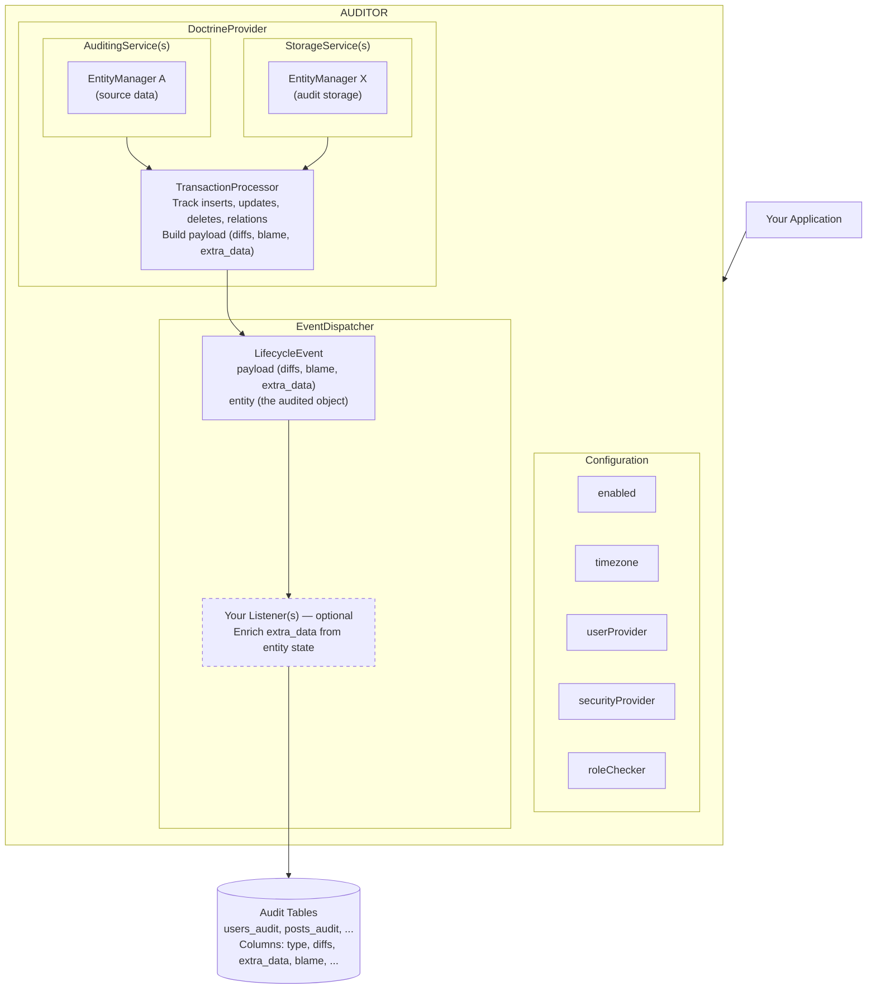

# auditor-doctrine-provider

> **Doctrine ORM provider for the auditor audit-log library**

## What is auditor-doctrine-provider?

**auditor-doctrine-provider** is the Doctrine ORM provider for the [auditor](https://github.com/DamienHarper/auditor) library. It brings automatic audit-logging to any application using [Doctrine ORM](https://www.doctrine-project.org/projects/orm.html), tracking inserts, updates, deletes, and many-to-many relationship changes on your entities.

### Key Features

- 📝 **Automatic change tracking** — Captures inserts, updates, and deletes automatically via Doctrine's `onFlush` event
- 🔗 **Relationship tracking** — Records many-to-many associations and dissociations
- 👤 **User attribution** — Records who made the changes and their IP address
- 🔒 **Transactional integrity** — Audit entries are inserted within the same database transaction as the originating flush
- 🎯 **Flexible configuration** — Choose which entities and fields to audit via PHP attributes or code
- 🔐 **Security controls** — Define who can view audit logs
- 🗄️ **Multi-database support** — Store audits in a separate database if needed

## Architecture Overview

The provider is built on top of the auditor core architecture:

1. **AuditingService** — Hooks into Doctrine's `onFlush` event to detect entity changes
2. **StorageService** — Persists audit entries to the database via prepared statements

### Data Flow

1. **Entity Change** → Your application modifies a Doctrine entity and calls `flush()`
2. **Detection** → `AuditingService` catches the `onFlush` event and collects entity changesets from the UnitOfWork
3. **Processing** → `TransactionProcessor` computes diffs and prepares audit data
4. **Event** → A `LifecycleEvent` is dispatched with the audit payload and the entity object
5. **Enrichment** *(optional)* → Your listener(s) inspect the entity and populate `extra_data`
6. **Persistence** → `StorageService` persists the audit entry to the database

## Supported Databases

| Database   | Support Level |
|------------|---------------|
| MySQL      | ✅ Full       |
| MariaDB    | ✅ Full       |
| PostgreSQL | ✅ Full       |
| SQLite     | ✅ Full       |

> [!NOTE]
> The DoctrineProvider should work with any database supported by Doctrine DBAL, though only the above are actively tested.

## Version Compatibility

| Version | Status                | Requirements                                                               |
|---------|-----------------------|----------------------------------------------------------------------------|
| 1.x     | Active development 🚀 | PHP >= 8.4, Doctrine DBAL >= 4.0, Doctrine ORM >= 3.2, auditor >= 4.0     |

## Quick Links

- [Installation Guide](getting-started/installation.md)
- [Quick Start](getting-started/quick-start.md)
- [DoctrineProvider](providers/doctrine/index.md)
- [Configuration Reference](providers/doctrine/configuration.md)
- [Querying Audits](querying/index.md)

## Related Projects

- **[auditor](https://github.com/DamienHarper/auditor)** — The core audit-log library
- **[auditor-bundle](https://github.com/DamienHarper/auditor-bundle)** — Symfony bundle integrating DoctrineProvider

## License

This library is released under the [MIT License](https://opensource.org/licenses/MIT).
