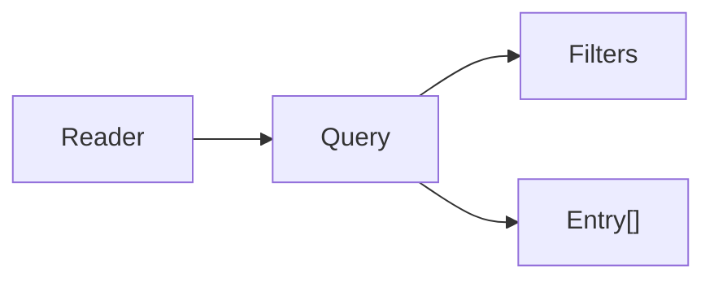

# Querying Audits

> **Read and query audit entries with the Reader and Query APIs**

This guide covers how to read and query audit entries using the `Reader` and `Query` APIs.

## 🔍 Overview

The DoctrineProvider includes a querying system built on top of Doctrine DBAL:



- **Reader** — Factory for creating queries and utilities
- **Query** — Builds and executes audit queries against DBAL
- **Filters** — Filter results by various criteria
- **Entry** — Represents a single audit log entry

## 📖 The Reader Class

### Namespace

```php
use DH\Auditor\Provider\Doctrine\Persistence\Reader\Reader;
```

### Creating a Reader

```php
$reader = new Reader($provider);
```

### Creating a Query

```php
// Simple query for all audits of an entity
$query = $reader->createQuery(App\Entity\Post::class);
$audits = $query->execute();

// Query with options
$query = $reader->createQuery(App\Entity\Post::class, [
    'object_id' => 42,        // Specific entity ID
    'type'      => 'update',  // Action type
    'page'      => 1,         // Pagination
    'page_size' => 20,
]);
```

### Query Options

| Option             | Type                    | Default | Description                               |
|--------------------|-------------------------|---------|-------------------------------------------|
| `object_id`        | `int\|string\|array`    | `null`  | Filter by entity ID(s)                    |
| `type`             | `string\|array`         | `null`  | Filter by action type(s)                  |
| `blame_id`         | `int\|string\|array`    | `null`  | Filter by user ID(s) who made changes     |
| `user_id`          | `int\|string\|array`    | `null`  | Alias for `blame_id`                      |
| `transaction_hash` | `string\|array`         | `null`  | Filter by transaction hash(es)            |
| `page`             | `int\|null`             | `1`     | Page number (1-based)                     |
| `page_size`        | `int\|null`             | `50`    | Number of entries per page                |

## 📄 Executing a Query

```php
// Returns an array of Entry objects
$entries = $query->execute();

// Returns the total count (ignoring pagination)
$total = $query->count();
```

## 📃 Pagination

```php
<?php

$query = $reader->createQuery(App\Entity\Post::class);
$result = $reader->paginate($query, page: 2, pageSize: 25);

// $result contains:
// 'results'         → array<Entry>
// 'currentPage'     → int
// 'hasPreviousPage' → bool
// 'hasNextPage'     → bool
// 'previousPage'    → int|null
// 'nextPage'        → int|null
// 'numPages'        → int
// 'haveToPaginate'  → bool
// 'numResults'      → int
// 'pageSize'        → int

foreach ($result['results'] as $entry) {
    echo $entry->type . ': ' . $entry->objectId . "\n";
}
```

## 🔎 Querying by Transaction Hash

Retrieve all audit entries related to the same flush batch across all configured entities:

```php
<?php

// Get all entries that belong to the same transaction
$byEntity = $reader->getAuditsByTransactionHash('abc123def456...');

// Returns: ['App\Entity\Post' => [Entry, ...], 'App\Entity\Comment' => [Entry, ...]]
foreach ($byEntity as $entityClass => $entries) {
    echo "Entity: $entityClass\n";
    foreach ($entries as $entry) {
        echo '  ' . $entry->type . ' #' . $entry->objectId . "\n";
    }
}
```

> [!NOTE]
> `getAuditsByTransactionHash()` silently skips entities for which the current user does not have the `view` role.

## 🔍 Filtering Examples

### Filter by Entity ID

```php
// Single ID
$query = $reader->createQuery(Post::class, ['object_id' => 42]);

// Multiple IDs
$query = $reader->createQuery(Post::class, ['object_id' => [1, 2, 3]]);
```

### Filter by Action Type

```php
// Single type
$query = $reader->createQuery(Post::class, ['type' => 'update']);

// Multiple types
$query = $reader->createQuery(Post::class, ['type' => ['insert', 'update']]);
```

### Filter by User

```php
$query = $reader->createQuery(Post::class, ['blame_id' => 'user-123']);
```

### Filter by Transaction Hash

```php
$query = $reader->createQuery(Post::class, ['transaction_hash' => 'abc123...']);
```

### Advanced Filtering

For advanced filtering not covered by the `createQuery` options, add filters directly on the `Query` object:

```php
<?php

use DH\Auditor\Provider\Doctrine\Persistence\Reader\Filter\DateRangeFilter;
use DH\Auditor\Provider\Doctrine\Persistence\Reader\Query;

$query = $reader->createQuery(Post::class);

// Filter by date range
$query->addFilter(new DateRangeFilter(
    Query::CREATED_AT,
    new \DateTimeImmutable('2024-01-01'),
    new \DateTimeImmutable('2024-12-31')
));

$entries = $query->execute();
```

See [Filters Reference](filters.md) for all available filters.

## 📦 Working with Entries

`Entry` objects use virtual properties (not getter methods):

```php
foreach ($entries as $entry) {
    $entry->id;               // int - audit entry ID
    $entry->type;             // string - 'insert', 'update', 'remove', 'associate', 'dissociate'
    $entry->objectId;         // string - entity primary key
    $entry->transactionHash;  // string|null
    $entry->diffs;            // array|null - already decoded from JSON
    $entry->extraData;        // array|null - already decoded from JSON
    $entry->userId;           // string|null - blame_id
    $entry->username;         // string|null - blame_user
    $entry->userFqdn;         // string|null - blame_user_fqdn
    $entry->userFirewall;     // string|null - blame_user_firewall
    $entry->ip;               // string|null
    $entry->createdAt;        // \DateTimeImmutable
}
```

> [!IMPORTANT]
> `$entry->extraData` and `$entry->diffs` are **already decoded** — they return `?array`, not a JSON string. Do not call `json_decode()` on them.

See [Entry Reference](entry.md) for a complete description.

## 🔐 Access Control

`Reader::createQuery()` automatically checks the role checker before returning the query:

```php
use DH\Auditor\Exception\AccessDeniedException;

try {
    $query = $reader->createQuery(App\Entity\Payment::class);
} catch (AccessDeniedException $e) {
    // Current user does not have permission to view Payment audits
}
```

---

## Next Steps

- 🔧 [Filters Reference](filters.md)
- 📦 [Entry Reference](entry.md)
- 💡 [Extra Data](../extra-data.md)
